# danmu-core

> 抖音直播的弹幕和礼物抓取，并存储至数据库

**示例:**

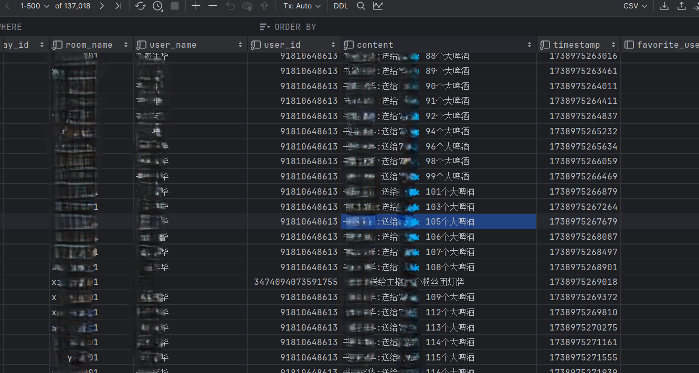
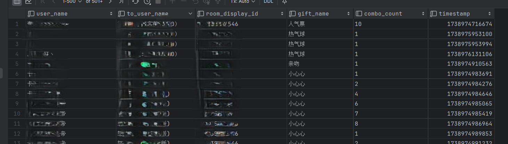
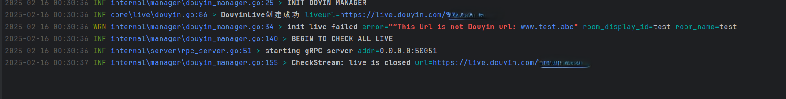

## 详情

### websocket


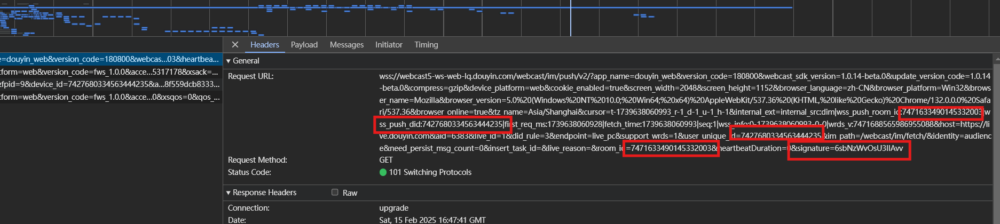
该wss请求为直播页面各项数据的推送，Payload包含 直播弹幕 礼物 直播间信息 礼物托盘 等数据,只需设置对应的room_id push_id 以及signature即可,
从initiator进入可以看到创建一个websocket client，`_getSocketParams()`构建socket连接参数


参考`biliup`项目的danmuka模块代码，可以看到该项目引用了一个webmssdk.es5.js的文件用来构建signature参数
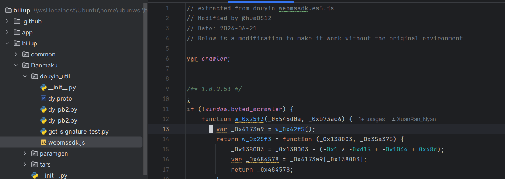
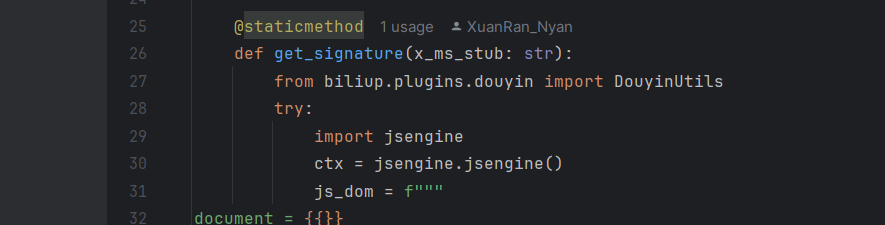
从`_getSocketParams()` debug进入，会看到调用`H()`方法用多个参数构建md5，md5传入`frontierSign()`进行构建signature，该函数来源自webmssdk.es5.js，本项目也参考这个方法，引入golang的js解释器，生成签名
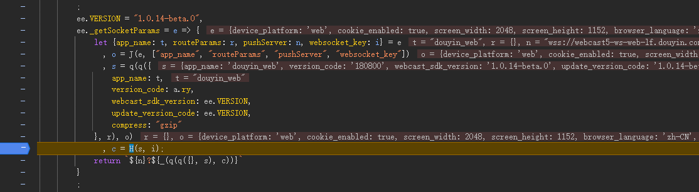
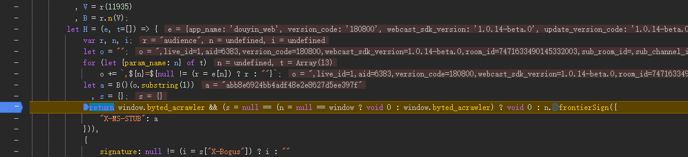
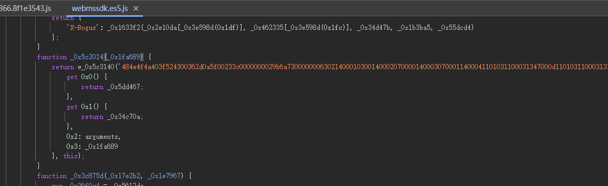
还能找到websocket client处理数据，发送Ack，发送心跳等方法。以及PushFrame携带的protobuf数据结构
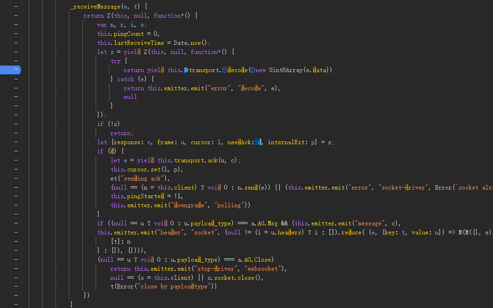

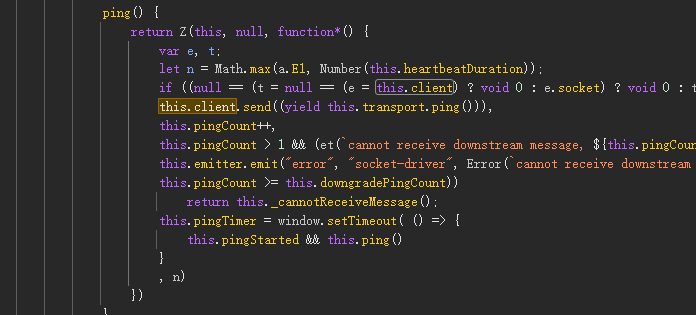

实际开发中发现websocket服务端会不定时的断开连接，直播关闭后也只是发送了一个关闭ws连接的信号，如果此时发送心跳的话依然可以接受到pong回应。无法正确判断直播是否关闭，也不能正确判断是否开播。最终参考`biliup`代码，由新的协程周期性的检测直播状态，控制websocket连接的开始和停止。

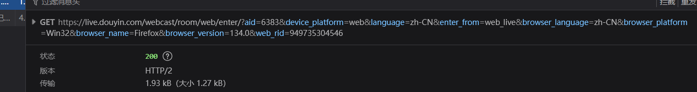


该请求返回值包含status代码，2则为正在直播。另外导出了rpc接口供其他程序控制弹幕监控协程。

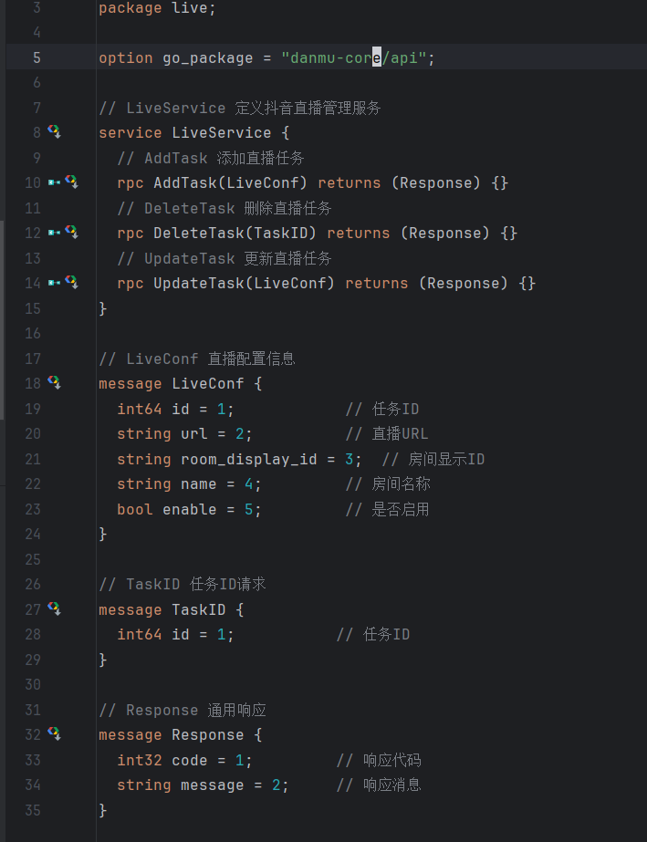


## 开始

###  项目使用条件

+ postgresql 用于数据存储
+ golang 环境

### 运行

1. 在posgtgresql中执行 `cmd/sql/migrate.sql`
2. 修改编写conf/app.ini，配置数据库连接
3. 向live-conf表中插入直播监听配置，项目启动后会从live-conf表获取所有的监听任务 
```sql
    insert into live.live_confs ( room_display_id, url, name, enable)
    values (
            '直播间id',
            'https://live.douyin.com/{直播间id}',
            '任意名称',
            true
    );
  ```
4. 启动 `cmd/main.go`

## danmu-http danmu-ui
> 基于golang gin gorm grpc的后端管理 + vite vue3 element-plus tailwindcss的前端ui。实现对danmu-core存储的数据查看以及计算。

**示例:**


## todo list

### not yet:

- [ ] 数据库自动migrate
- [ ] 引入cron表达式，控制监听周期
- [ ] 添加Makefile
- [ ] 添加dockerfile docker-compose.yml

### done:

- [x] vite vue3 创建前端页面，查看数据
- [x] gin gorm创建crud管理,实现弹幕礼物数据查看，以及权限登陆控制，grpc控制core监控任务
- [x] core grpc接口，控制 新建 更新 删除 直播监听协程
- [x] 周期性检测开播状态
- [x] 礼物数据落库
- [x] 弹幕数据落库
- [x] 送礼用户落库
